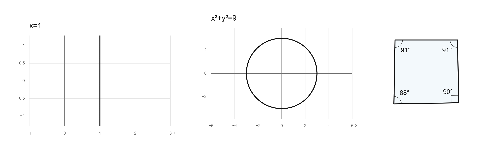

# Chalkpal

A magic whiteboard prototype: indicate a place on the canvas, ask for a graph or equation, and refine that object by speaking or typing. Excalidraw supplies the drawing surface and pointer interactions. The application owns the editable document, AI commands, math editors, notebooks, and shared undo history.

The default is plain white paper. Equations, graphs, text, and geometry have transparent backgrounds. The project supports desktop development and testing on a physical iPad.

## Run locally

Requires a current Node.js installation compatible with Vite 7 (Node 22.12+ recommended).

```powershell
npm install
npm run dev
```

Open <http://localhost:3000>. Keep the terminal running. The server reads the hackathon key from `api.txt` in this directory, or from the `OPENAI_API_KEY` environment variable. Never put the key in a `VITE_` variable, client code, or a shared project file.

```powershell
npm run check
npm test
npm run build
npm start
```

`npm start` serves the previously built `dist` directory. `PORT` changes the default port. `OPENAI_TEXT_MODEL`, `OPENAI_REALTIME_MODEL`, and `OPENAI_IMAGE_MODEL` override the default models on the server.

## First interaction

1. Choose the magic pen, then click a location or draw around a region.
2. Type or say, “Plot y = sin(x) here, showing two full oscillations.”
3. Keep that object as your focus and ask, “Make the amplitude two,” or, “Use zero to ten.”
4. Indicate a new region and ask to move or resize the object there. Rotation, relative size changes, and undo are supported through board operations.
5. Try “Write the integral of sin(x) from two to five,” or, “Create a labeled right triangle.”

The empty board offers a graph example and a sample homework page. These add content to the current notebook. You can also load the sample homework background from Help. Backgrounds can be removed from Page settings, with Undo available afterward.

Use ordinary drawing and selection to annotate, drag, resize, and rotate objects. To edit individual characters, double-click text or an equation, or select it and choose **Edit on board**. MathLive provides a visual equation editor, including a math keyboard; **LaTeX source** switches to source editing. A graph's expression can also be edited directly.

## Object controls and live source

Select an object to open **Object controls**. The card stays available while editing its content. Collapsing it leaves an **Object controls** button to reopen it; deselecting the object closes its controls.

Edit the **Function or equation**, **LaTeX source**, or text field to update the board automatically after a short typing pause. Valid drafts compile locally, without an AI request. An incomplete or invalid expression stays in the field with an explanation while the board keeps its last valid version. **Restore last valid** discards that invalid draft. Ctrl/Cmd+Enter or leaving the field also applies a valid draft.

The card provides manual ink color, font size, graph/shape line width, shape fill and fill opacity, object opacity, size, rotation, layer order, and locking controls where applicable. Graph controls include X/Y limits, axis scaling, and separate grid/axes switches. Numeric fields apply on Enter or when leaving the field. Unlock a locked object before changing it.

**Zoom to object** brings the selected item into view without changing its contents. Voice and typed commands can also set an object's color, fill, opacity, rotation, crop, or layer: try “Bring this shape to the front.” Valid source edits are flushed before saving, exporting, or switching notebooks.

## Equations and custom geometry

Graphs support explicit functions such as `y=sin(x)` and implicit equations such as `x=1`, `x^2+y^2=9`, and `xy=1`. An equality involving both variables draws its numerically sampled zero contour in the visible graph window. This supports vertical lines, circles, and relations that are not single-valued functions of X. Graphs remain sampled approximations; a very small feature or discontinuity may need a different view. Inequalities, shaded solution regions, and a general symbolic equation solver are not implemented.

Implicit contour sampling can miss isolated points, tangencies without a sign change, or features smaller than the sampling grid. Check the graph against the source; it is not a complete mathematical solution-set oracle.



Ask, “Draw a quadrilateral with interior angles 91, 91, 90, and 88 degrees.” The polygon uses four actual vertices with those angles; labels are not substituted for geometric constraints. Convex angle lists must have 3–16 entries, each between 0.1° and 179.9°, and sum to `(n−2)×180°`. Inconsistent sums, crossing edges, and degenerate shapes return an explanation.

Angle constraints alone do not uniquely determine side lengths. The app chooses one valid convex construction tangent to a circle. Resizing fits the polygon uniformly within its object bounds to preserve its angles, so it may leave space inside a wide or tall box. Explicit custom polygons use 3–16 ordered normalized vertices (`{x,y}`, each coordinate from 0 to 1); open polylines use 2–16 vertices. One coordinate scale is preserved when fitting them. If both vertices and angles are supplied, they must agree. Comma-separated text such as `A,B,C,D` supplies vertex labels.

## Placement and graph scale

The magic pen offers two focus modes, saved separately for each notebook:

- **Reference** is the default. A circled region supplies a location and context. New objects use its center as a placement reference and retain readable, natural proportions; the circle does not prescribe an exact width and height.
- **Literal** treats the circled region as a boundary. New objects use that area, and AI edits, moves, and resizes must stay inside it. Changes to objects outside the region are rejected. Draw a larger area if content cannot fit. Use this for a specific space on a worksheet or a deliberate layout.

A graph also has its own axis-scaling choice. **Equal units** gives one unit on each axis the same visual length, so `y = x` appears at 45 degrees and a circle retains its proportions. It preserves the chosen x range and adjusts the displayed y range; parts of a tall curve can be outside the visible window. **Independent axes** uses separate horizontal and vertical scales; editing a Y limit selects this mode. Explicit functions can receive an automatic initial Y range, while implicit equations use a finite two-dimensional view. **Natural graph size** restores a comfortable rectangle and equal units on an existing graph. Placement mode and graph axis scaling control different things.

## Voice interaction

**Voice mode** hides the typing bar and shows the microphone control, live transcript, and an action selector. The microphone circle responds to measured microphone volume (RMS). Choose **Assistant** for board commands, **Dictate math** for equations, or **Dictate text** for prose. Spoken replies are optional.

**Dictate text** writes finalized speech transcripts directly into editable text, without a conversational model deciding whether to write. Questions and command-like sentences are literal content; switch to Assistant for editing instructions. Paused phrases append in order to the same unchanged writing target, with at most eight pending phrases. A missing transcript can recover from its original audio. Changing the target or stopping voice cancels obsolete writing. Assistant feedback defaults to English; requested board content keeps its own language.

Realtime request/token rate limits are independent of remaining API credit. The app honors short provider retry/reset hints, pauses input during the wait, and makes at most one same-session retry of an unapplied instruction on an unchanged board. It does not send capacity errors to the repair model. Longer waits or a repeated rejection pause voice for manual resumption. Successful tool results omit repeated board snapshots, and silent edits skip confirmation generations. See [the text and rate-limit verification report](research/TEXT_DICTATION_RATE_LIMIT_FIX.md).

The connection provides continuous audio input, turn detection, transcripts, and board tool calls. **Dictate math** now draws a temporary LaTeX preview from incoming transcription chunks for common integrals, functions, powers, fractions, Greek symbols, evaluation bars, and arithmetic. Say “the integral of,” then continue with “sine x d x”; the draft grows as those words become available. “This now equals negative cosine of x bar from pi to two pi” appends an evaluation step to the current equation without calculating it. Existing math can receive continuation previews, and validated source selections can be replaced. The model's streamed output takes over from the local draft and only a validated final operation changes the document. Unknown or ambiguous phrases wait for the model instead of displaying guessed math.

Transcription and generation latency still apply: the current input model can wait for a short speech pause before sending chunks. This is not guaranteed per-word compilation during uninterrupted speech. In an open source/MathLive editor, the live draft is read-only and separate from editable source; typing or selecting characters cannot accidentally accept speculative AI text. Moving the target, changing its source, changing dictation mode, stopping voice, or entering recovery clears stale transcript drafts.

**Pause microphone** closes the local audio connection and requests server-side session shutdown. Turning spoken replies off only silences the assistant; it does not pause the microphone or end API usage. Active voice sessions renew in segments of at most five minutes, within the cumulative allowance, and pause after 90 seconds of inactivity. Recovery temporarily pauses audio and shows its progress. A cancelled request, changed board, or new instruction prevents an obsolete repair from being applied.

## Notebooks

Use **Notebooks** to create, rename, and switch between separate boards. Each notebook has its own canvas, title, paper, and layout settings. The previous single-board prototype is retained as the first notebook, using its existing storage key.

Canvas changes are checkpointed locally, and switching waits for the current checkpoint to finish. A failed save keeps the current notebook open and reports the problem. Notebook metadata has a recovery backup, and canvas checkpoints are stored in IndexedDB. Earlier prototype notebooks are migrated from these checkpoints or read-only legacy storage, including supported encoded handwriting and embedded image data. Unreadable or unsupported documents produce an error before replacement; their saved copies remain intact, and you can switch to another notebook. There is no notebook deletion control in this version.

Notebooks belong to the current browser profile and website address on this device. Another browser, device, or newly generated preview hostname has a separate local library. Download an editable `.marginalia.json` file to transfer a notebook or keep a backup. There is no shared cloud document store yet. **Open notebook file** replaces the active board; create a new notebook first if you want to keep the current one separately.

Before replacing an earlier SDK checkpoint, the app preserves its original schema, encoded handwriting, images and other records in an immutable `pre-owned-canvas:<notebook id>` archive in the checkpoint database. Repeated migration attempts do not replace that first archive. Migration stops if the archive cannot be saved. In **Help**, choose **Download original notebook backup** to retrieve it without changing the current board. The archive does not appear as another notebook or automatically make an old app understand the new checkpoint format. Notebooks created after migration have no earlier checkpoint to download.

The `.marginalia.json` file extension and existing browser-storage keys are retained for compatibility with notebooks saved under the earlier Magic Whiteboard and Marginalia names.

## Images, pages, and saving

- **Generate image** opens a description and a shaded placement preview. Voice or typed image requests can propose the same review step. Review the description, dimensions, and region, then use the checkmark to confirm the paid request. A proposal alone never starts generation. The generated PNG becomes an ordinary portable image after insertion.
- Import a PNG, JPEG, WebP, or GIF as an ordinary image or a locked background. Pasted screenshots use the same portable image storage. A new background replaces the previous background on the current board.
- **Image crop** in Object controls hides percentages from the left, right, top, and bottom edges without deleting the original image bytes. **Reset crop** restores the full image. Unlock a background before cropping it. The crop is used in the live board, PNG/PDF export, and AI board captures.
- A4 mode uses a fixed 794 × 1123 canvas region; infinite mode expands around the content. Choose plain, dotted, grid, or ruled paper and a background color.
- PNG and PDF exports include the entire current board and its locked image background. A4 mode crops to the page; infinite mode includes all content with a small margin.
- PDF output contains a high-resolution flattened rendering. Graph expressions and equations remain editable in the app and in downloaded `.marginalia.json` project files.
- Project files contain editable scene records, embedded images, and board settings. They never include server credentials. Project import validates and migrates the document before replacing the active board. The legacy `.marginalia.json` format remains supported.
- Local browser storage holds each notebook. Download an editable project backup before switching browsers/devices, changing preview addresses, or clearing website data.

Image input is limited to 12 MB; large photographs are resized to at most 2400 pixels on their longest side. Project import is limited to 40 MB.

**Import** accepts PDFs as well as images. Choose **Put on the board** to add each PDF page as a locked sheet you can annotate, or **Save to library** to keep the original PDF in this browser and retrieve pages or problems later. Board imports support up to 120 pages and 40 MB, subject to notebook storage limits. Multi-page imports use the infinite canvas; a single page can fit the A4 background.

**Library** opens saved books in a reference panel. Search for a printed page, section, exercise, or example, then insert a page, a detected problem, or a manual crop. Search uses the PDF's text layer; scanned pages without text need manual browsing and cropping. Placement leaves room around existing work. Jev can rank candidates when configured; local ranking remains available without a key. **Selected area PDF** exports a circled region or selected objects. Library books stay in this browser; inserted page images travel with an editable notebook backup.

Generated images use low quality and one of `1024x1024`, `1536x1024`, or `1024x1536`. The server runs one image generation at a time with a bounded queue; polling the job does not create another request. Image jobs never retry the provider automatically. A timeout can still incur a charge, so the request ID and reservation remain recorded. Generated results are temporarily cached on the server for up to 30 minutes, subject to a memory bound; inserted images are saved with the notebook. A server restart loses temporary results but retains hashed request IDs, preventing an old request from being charged again automatically.

Screenshot and ink understanding is experimental. Typed commands include an image of the focused region or viewport when the board contains an image or ink. In a voice session, the assistant can call `inspect_board` to capture that region on demand. The crop includes complete selected strokes and a small margin, and is scaled to at most 1024 pixels on the longest side.

Select or loosely circle handwriting to reveal **Clean up handwriting** and **Plot this handwriting**. Cleanup asks the assistant to create editable text and equations, then replace only the selected ink after successful creation; it keeps a homework background. Plotting asks it to read the function and create a nearby graph while retaining the original ink. These are deliberate AI actions, not automatic handwriting conversion or reliable OCR. Inspect recognized symbols and use Undo if needed, especially for small or ambiguous writing.

## Test on iPad

Run the server on the Windows computer and open its HTTPS preview URL on the iPad. The microphone requires a secure browser context: a plain `http://192.168...` LAN URL can load the board but cannot provide normal microphone access. `http://localhost:3000` is suitable for desktop testing.

The backend requires a six-digit device pairing code for a remote browser. On the laptop, open **Help & iPad connection** at `http://localhost:3000` to read the current code, then enter it on the iPad. The server terminal also shows it. Pairing permits AI use through the laptop; it does not synchronize notebooks. The code changes when the server restarts and is not displayed to remote browsers.

Use Safari's Add to Home Screen option for an app-style entry point. This is currently a web application, not a signed native iPad binary. Drawing quality, Apple Pencil behavior, microphone routing, and export/download behavior should be tested on the actual device. A future native package can wrap this application or replace the drawing surface with native ink.

An application manifest and iPad home-screen icon are included. There is no offline application cache yet; open the app while the Windows server and HTTPS preview are running.

## Voice and API cost

The canvas, drawing, rendering, image import, source compilation, and file export run locally. Natural-language commands, Realtime voice, and confirmed image generation use the paid OpenAI API with this project's server-side key.

Codex can use a ChatGPT sign-in for subscription access, or an API key for usage-based access. That development-tool login does not replace the Platform API key used by this application; general API calls use separate API billing. See [official Codex authentication documentation](https://developers.openai.com/codex/auth/).

Default backend models:

- Typed commands: `gpt-6-luna` with low reasoning effort, using a constrained board-operation tool. The response budget includes reasoning and the complete edit payload; incomplete responses never change the board.
- Voice: `gpt-realtime-mini`, with `gpt-4o-mini-transcribe` for visible input transcription.
- Confirmed image generation: `gpt-image-2.5-flare`, low quality, one PNG per request.

Luna is a text/image model, not a Realtime audio model; switching the typed-command default does not change the voice model. At the standard short-context rates checked September 26, 2026, Luna costs $0.10 input / $0.50 output per million tokens, compared with $0.40 / $1.60 for the previous `gpt-4.1-mini` default. Reasoning tokens count as output, and total cost depends on tokens used. See [official API pricing](https://developers.openai.com/api/docs/pricing).

Math commands validate complete LaTeX before changing an object. Appending fragments preserves command boundaries, and invalid source keeps the last valid equation visible. In Assistant mode, “equals what?” asks for the result of the selected expression; Dictate math remains transcription. Malformed command output can receive one Luna correction using the original instruction and snapshot. A rejected content edit is constrained to the same unchanged targets; failed content creation is retried only as a completely failed creation batch on an unchanged board. Partially successful batches are never repeated automatically. A new instruction, changed target, cancellation, or repeated failure stops recovery.

Typed requests share a maximum of three upstream attempts across the initial response and one semantic correction; a voice repair request allows at most two transport attempts for its single correction. Both have a 30-second total deadline. Temporary service or rate-limit failures use bounded backoff and respect `Retry-After`; a delay longer than the deadline stops the request. Authentication, credit, quota, and local allowance failures are not retried. Unknown or inconsistent function names also receive the same bounded repair, without treating aliases as permission to execute tools. Complete operation lists are schema-validated before they reach the board; incomplete or ambiguous output is never partially applied.

Voice recovery no longer abandons a missing transcript after 1.5 seconds. It waits up to six seconds, then retrieves the exact committed user-audio item. A finalized transcript on that item is reused; otherwise a dedicated `gpt-4o-mini-transcribe` request transcribes the original audio before the correction. Retrieval has a four-second deadline and fallback transcription has an 18-second deadline. The full client recovery, including the existing repair request, is bounded to one minute. Fallback audio is limited to 100 ms through 30 seconds of PCM and is processed in memory, never saved to disk. Stop cancels recovery, and a different finalized transcript or changed board prevents an obsolete correction. See [the transcript recovery checks](research/TRANSCRIPT_RECOVERY_FIX.md).

Help displays the running server's configured text, voice, and image models. Model environment variables can change the defaults. The app responds to typed instructions and user-started voice turns through board tools; it has no autonomous background agent that continues working on notebooks.

The default cumulative allowances are 200 command/transcription attempts, 180 reserved voice minutes, and 20 confirmed image requests. Command attempts include typed requests, repair calls, transient retries, and fallback speech transcription. Image reservations include failed or timed-out generations because those can still be billed. Voice reserves at most five minutes per segment and returns unused time only after the provider confirms closure; an uncertain close retains its reservation and is retried in the background.

Explicit server environment overrides are `OPENAI_COMMAND_LIMIT` (1–1,000,000), `OPENAI_VOICE_MINUTES_LIMIT` (1–1440), and `OPENAI_IMAGE_LIMIT` (1–1000). Values must be whole numbers; out-of-range numbers are clamped. Changing a limit preserves consumption already recorded. Counters do not reset daily or on restart.

Counters and SHA-256 image request-ID tombstones persist in the ignored `.local/usage.json` file. Reservations are serialized and saved with a flushed temporary file and atomic rename before a paid request is sent. Corrupt or unreadable counters disable paid requests instead of resetting to zero; preserve and repair that file before restarting. These are local usage allowances, **not a guaranteed dollar spending cap**; account billing and available credits are authoritative. Pause the microphone when finished and check OpenAI billing before raising allowances.

The API key stays on the server. `api.txt`, `.env` files, and local usage records are ignored by Git and blocked from HTTP serving. Browser sessions receive an audio connection and board commands, not the permanent API key. Do not publish the workspace itself as static files.

## Architecture

- React 19 and TypeScript provide the application shell.
- Excalidraw `0.18.1` supplies handwriting, selection, dragging, resizing, rotation, pan, and zoom. The app exposes a focused set of controls.
- The application document remains the source of truth. An adapter translates its records into Excalidraw elements and applies native changes back to those records.
- The application owns one undo history for drawing gestures, direct edits, and AI commands. It completes pointer interactions before applying an external edit.
- Custom `magic` shapes retain expressions, LaTeX, geometry, labels, ranges, and object IDs. Excalidraw element metadata also preserves their source records.
- Custom math, graphs, text, and geometry appear as generated PNG images inside Excalidraw. Their source remains editable through the app's live editors and inspector.
- mathjs parses allowlisted scalar expressions and equalities. Sampled SVG paths render explicit functions and implicit contours. Shared geometry helpers construct and validate angle-constrained polygons with uniform fitting. KaTeX renders equations; MathLive supplies direct editing and a math keyboard.
- IndexedDB stores each notebook's editable records and embedded image assets. Portable `.marginalia.json` files, legacy migration, and application PNG/PDF export remain supported.
- A Vite plugin serves Excalidraw fonts locally and includes them in production builds. The app sets `EXCALIDRAW_ASSET_PATH` to this local directory.
- An Express backend calls the Responses API for typed commands and negotiates WebRTC Realtime sessions for voice.
- The assistant receives the selection, spatial focus, pointer, viewport, relevant objects, and recent conversation. Typed commands and Realtime's `inspect_board` tool can include board images.

The integration uses the published Excalidraw React component. It does not extract selected internals into a separate drawing engine. Hiding controls does not remove their code from the dependency. Bundle size remains an optimization task.

The app supports its own objects, handwriting, and embedded raster images through the native clipboard. Arbitrary elements copied from another Excalidraw document (such as native arrows, frames, or styled text) are rejected before changing the notebook because their full editable/export representation is not implemented. Use the app's text, math, and shape controls. Earlier continuous handwriting may look different with Excalidraw's pressure rendering; separate legacy ink segments remain separate.

See the [latest integration checks](research/EXCALIDRAW_LATEST_MERGE.md) for the merge of the port with the current AI and equation fixes.

Start with `src/canvas/WhiteboardCanvas.tsx`, `src/canvas/excalidrawScene.ts`, and `src/canvas/liveContentImage.ts` for the integration. The document and history live in `src/canvas/editor.ts`. Math, notebook, file, and AI logic remain in `src/board/`, `src/notebooks/`, `src/files/`, `shared/board.ts`, and `server/`.

The original application code is proprietary. See [LICENSE](LICENSE). Excalidraw uses the MIT license. Its bundled fonts have separate terms, including OFL, MIT, and GPL v2 with the Liberation font exception. Preserve [THIRD_PARTY_NOTICES.txt](THIRD_PARTY_NOTICES.txt), which the app also serves.

The [dependency inventory](research/production-license-inventory.json) and notices cover the installed port dependencies. The notices retain unresolved attribution gaps for `@arnog/colors` and `react-remove-scroll-bar`. The earlier [commercial distribution audit](research/COMMERCIALIZATION.md) describes the previous canvas and does not cover this port.

## Scope and next steps

This prototype is strongest at graph creation and revision, equations, constrained polygons, and spatial board editing. It is not yet a comprehensive solver or a source of verified mathematical proofs.

See the [earlier Excalidraw interaction review](research/EXCALIDRAW-INSPIRATION.md) for reusable templates, bound connectors, and structured AI diagram tools. This branch now uses the Excalidraw package as described above. Team development follows [the feature-branch workflow](CONTRIBUTING.md).

1. Test a full voice/pen interaction on the physical iPad, especially the timing of “this” and “here.”
2. Improve handwriting cleanup with a reviewable recognition preview, symbol corrections, and an explicit keep-original option.
3. Add ordered document/LaTeX export and improve recognition of scanned PDF content.
4. Improve offline recovery, cloud document synchronization, and collaboration.
5. Evaluate native packaging and high-fidelity Pencil input after measuring the browser experience.
6. Improve continuous speech-to-math latency and vocabulary; transcript drafts are incremental, while final voice edits remain turn-based.

Automated tests cover command validation, geometry, file validation, notebook migration/isolation, and serialized checkpoint persistence. Browser visual checks and physical-iPad verification remain separate from those tests; do not infer device readiness from a successful TypeScript build alone.

## Development workflow

Keep `main` stable. Work on feature branches and merge through reviewed pull requests. See [CONTRIBUTING.md](CONTRIBUTING.md).

## Validation

Run `npm run check`, `npm test`, `npm run build`, and `npm audit` after dependency or integration changes. Automated tests cover scene conversion, custom image identity, history, file handling, notebook persistence, migration, and board commands. Test results from the previous canvas do not establish Excalidraw port readiness.

The command, voice, image-service, security, and durable-usage test groups passed 178 tests during this update, along with TypeScript checking. Those tests use simulated providers and do not verify live API model access, image-generation charges, or physical microphone behavior. Usage tests cover concurrent reservations, corruption, disk failure, restart persistence, and recording image request tombstones before provider invocation.

See the [Excalidraw port verification report](research/EXCALIDRAW_PORT.md) for the browser checks, fixes, integration tradeoffs, and repeatable smoke script from this branch.

The [interactive math merge report](research/INTERACTIVE_MATH_MERGE.md) records the subsequent integration, 291 automated tests, and ego-browser checks against development and production builds.

Browser testing must include drawing over math and image backgrounds, selection, transforms, direct editing, AI edits, undo/redo, notebook switching, reload, and file exports. A full voice session, Apple Pencil pressure, touch gestures, and iPad download behavior still require tests on the physical device. PNG previews use bounded resolution, so extreme zoom can expose raster pixels.

## Temporary HTTPS preview

The hackathon setup uses an account-free [Cloudflare Quick Tunnel](https://developers.cloudflare.com/cloudflare-one/networks/connectors/cloudflare-tunnel/do-more-with-tunnels/trycloudflare/). It is a temporary development preview: the computer and both processes must stay running. The board itself remains in each browser's local storage; opening the URL on another device starts that device's own board.

The verified official Windows binary is stored in ignored `.local/cloudflared.exe`. On a fresh checkout, obtain the Windows 64-bit executable from [Cloudflare's official downloads](https://developers.cloudflare.com/cloudflare-one/networks/connectors/cloudflare-tunnel/downloads/) and save it there. The installed version for this session is `2026.9.3`, checked against the official GitHub release asset's SHA-256 digest.

Start a new preview in PowerShell:

```powershell
.\server\start-tunnel.ps1
npm run dev
```

On macOS, Linux or Windows, the cross platform helper does the same with `cloudflared` from `.local` or from your PATH, and reads `PORT` (default 3000):

```sh
node server/start-tunnel.mjs
npm run dev
```

The helpers print the HTTPS URL and tunnel process ID, and save the generated hostname in `.local/preview-host.txt`. In development, Vite accepts any `*.trycloudflare.com` hostname, so a server that is already running does not need a restart for a new tunnel. Cloudflare assigns those names, so they cannot be pointed back at this computer by someone else. The helpers install no service and make no autostart change.

Open the HTTPS URL in Safari on the iPad, enter the pairing code from **Help & iPad connection** on the laptop, and use **Check voice connection** before starting the microphone. On the laptop, use `http://localhost:3000`. Stop the app with Ctrl+C. Stop the tunnel with the stop command printed by the helper; stop an old tunnel before starting another. A newly started tunnel receives a different URL and therefore a separate browser-storage origin; download notebook files before changing preview addresses. A server restart changes the pairing code, and so do 20 wrong pairing attempts; Help on the laptop always shows the current code.

To check only the OpenAI voice configuration without opening media, run `npx tsx server/check-realtime.ts`. The script reports success or an error without printing credentials. Actual speech, pen latency, and iPad audio behavior still require device testing.
