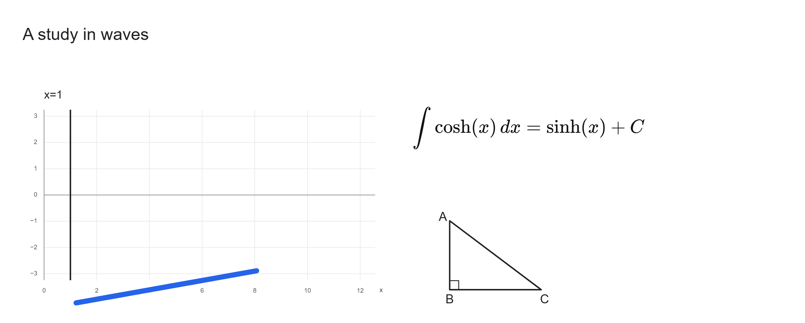

# Excalidraw integration with the latest interactive math branch

Verified September 27, 2026. Integrates `codex/excalidraw-port` at `1a26261`
into `feat/interactive-math` at `30423b5`. The common ancestor is `92c5d7f`:
the port had already incorporated the earlier interactive math work.

The merge was prepared in an isolated worktree before updating the running
application. Git reported no textual conflicts, but integration testing found
behavioral problems requiring the fixes below.

## Result and fixes

- Retains Excalidraw 0.18.1 as the drawing surface, the application document
  model, shared undo history, notebook storage, local fonts, editable source,
  implicit equations, constrained polygons, appearance controls, and cropping.
- Preserves the latest Luna default and response budget, complete LaTeX
  validation, append boundaries, and bounded voice-edit repair. The server and
  AI client files are unchanged from `30423b5`.
- Displays transient streamed content over an already-rendered native image.
  The preview does not change stored source or add history entries. Committing
  or clearing a preview restores native scene rendering.
- Preserves disconnected legacy ink segments, pressure samples, and source
  identity through native transforms, duplication, save/reload, and export.
  These strokes use an image proxy; ordinary continuous strokes remain native.
- Validates incoming clipboard elements before any document change. Unsupported
  foreign Excalidraw elements produce a dismissible error and restore the
  current scene instead of creating a document that cannot be reopened.
- Uses Excalidraw's public `getFreeDrawSvgPath` for continuous-ink export. The
  previous SVG renderer produced visibly thinner strokes than the new canvas.
  A browser-installed bridge keeps the document and Node test modules DOM-free.

## Verification for this merge

- `npm test -- --reporter=dot`: **357 tests passed in 33 files**.
- `npm run build`: passed, including TypeScript validation. The main entry is
  approximately 3.21 MB minified / 1.04 MB gzip. Existing large-chunk and
  static/dynamic import warnings remain.
- `npm ci`: clean installation; audit reported zero known vulnerabilities.
- Native-import, disconnected-ink, streaming-preview, and ink-export regression
  tests were added. Renderer tests verify width, pressure, and simulation data
  forwarding; an actual browser export verifies the public renderer output.

Browser checks used Chrome and ordinary controls at `localhost:3014` in the
separate **Merged canvas checks** notebook. Checks covered example creation,
renaming, native pencil ink, implicit `x=1`, longer LaTeX source, MathLive/source
editing, inspector collapse/reopen, math undo/redo, fit/zoom, persisted reload,
PNG export, and editable notebook download. The reopened notebook retained five
objects and editable sources without an application error. Four custom objects
completed native bitmap rendering. The corrected PNG was visually compared with
the canvas, including stroke thickness, graph, equation, text, and triangle.

The original [port report](EXCALIDRAW_PORT.md) and [earlier math integration
report](INTERACTIVE_MATH_MERGE.md) describe their own broader verification runs;
those are historical evidence, not checks repeated for this merge. This run
made no paid API requests and did not activate the microphone. Streaming
visibility was checked through regression tests and code review, not a new
spoken session. Actual iPad/Apple Pencil acceptance testing remains necessary.

## Limits and distribution notes

This is the published Excalidraw canvas with focused app controls, not the entire
excalidraw.com product. Source-backed app content, native ink, and embedded
PNG/JPEG/WebP/GIF images are supported. Foreign native arrows, shapes, styled
text, frames, embeds, SVG, and external image URLs are rejected because full
round-trip support is not implemented. It is not a general `.excalidraw` importer.

Custom equations, graphs, text, and geometry retain editable source but use
bounded-resolution images in the native scene. Export renders their source.
Earlier continuous ink can look different under Excalidraw's pressure renderer;
this merge makes export match that canvas, without guessing a stroke's origin.

Excalidraw is MIT-licensed; that is not an absence of license obligations.
The port's package/font notices and cross-platform dependency inventory are
retained, including optional packages absent from a Windows install. Original
application code remains proprietary. Before commercial redistribution, resolve
the existing attribution gaps for `@arnog/colors` and
`react-remove-scroll-bar`, and document the applicable Liberation font
source/offer distribution path (GPL v2 with its font exception). This integration
does not assert distribution clearance.
