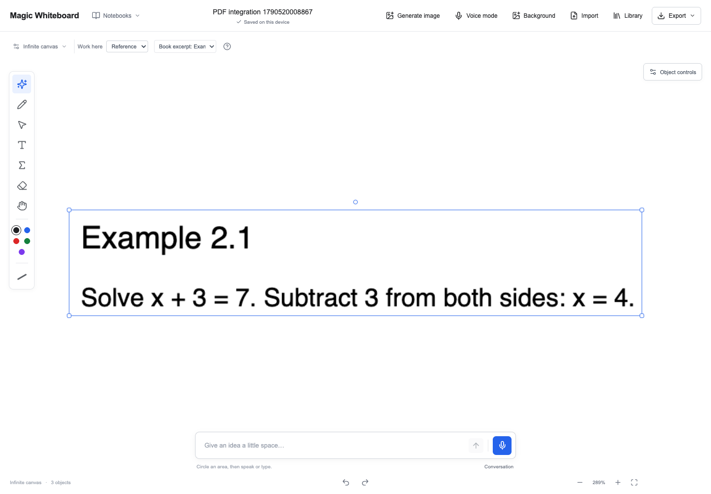

# PDF, math and hardening integration

Verified September 27, 2026, with Node 22.23.2.

The `feature` branch starts from remote `main` at `093bf5c` and incorporates:

- `pdf-worker` and `claude/pdf-worker` at `4592522` (identical tips).
- `feat/interactive-math` at `a2d89cd`.
- `codex/excalidraw-port` at `1a26261`, already included in `main`.

The PDF branch was merged first because it already contains the shared voice,
image generation and earlier math commits. The second merge needed manual
resolution only in `src/ai/realtime.ts` and `src/styles.css`. The result retains
filler cancellation, command continuation after a cough or filler, compact
library context, unknown-tool recovery, and temporary spoken-math previews.
Both branches' interface styles are retained.

The final fetch also brought in delayed-transcript recovery at `a2d89cd`.
Its additional overlaps in the server imports and voice state were resolved by
retaining both library ranking and audio transcription, along with the PDF
branch's board-state validation. The full suite and production build were rerun
after this merge.

Two added voice regressions cover the overlap: a final filler transcript clears
an earlier speculative math draft, and filler interrupting an active integral
request still permits exactly one completed edit. The README now documents PDF
import and the local textbook library. Production notices include PDF.js and its
installed canvas dependencies. The nanoid 3 override now covers the full major
version range, so both Excalidraw's exact requirement and PostCSS's range resolve
consistently during dependency inspection; installed versions and the lockfile
remain unchanged.

## Automated checks

- `npm ci` succeeded.
- `npm run check` passed.
- `npm test`: 1,110 passed, six skipped, across 66 files. The skipped checks depend
  on untracked local textbook PDFs. Synthetic PDF indexing and rendering tests ran.
- `npm run build` passed. Existing chunk-size, mixed dynamic/static import and
  third-party annotation warnings remain.
- `npm audit`: zero reported vulnerabilities.
- `npm ls --omit=dev --all --parseable` and notice generation succeeded.
- `git diff --check` passed after removing a trailing blank line in an imported test.

## Browser verification

Ego Browser used separate localhost origins on ports 4317 (development) and
4318 (production), leaving the usual app origin's notebooks untouched.

The existing `tests/browser/ego-interactive-math-smoke.js` passed on both builds:
notebook creation/reload, graph movement and independent resize, duplicate,
undo/redo, implicit equation editing, invalid draft recovery, object locking,
inline LaTeX editing, colored ink, eraser, and flushing a pending text edit before
switching notebooks.

These browser runs preceded the final transcript-recovery commit. That commit
changes voice recovery and preview parsing, not the PDF or canvas UI; its new
regressions and both integration regressions passed in the final full suite.

PDF workflows were exercised manually in development and through the new
`tests/browser/ego-pdf-library-smoke.js` against the production build. The script
generates a two-page algebra workbook and checks:

- Import both pages as locked sheets; undo/redo; persist and reload.
- Save the PDF to the library, search for `Example 2.1`, and insert its exact crop.
- Download a selected-area PDF, whole-board PNG, and editable notebook.
- Restore the editable backup into a separate notebook, then reload it.
- Open and dismiss image-generation review without issuing a paid request.

The exported PNG and a rendered selected-area PDF were visually inspected. The
backup contains two locked PDF pages, one unlocked book excerpt, and three
embedded raster assets. Production PDF fonts, character maps, WebAssembly and
color profiles match their installed package bytes. The library and reference
panel were also checked at 768 × 1024, without horizontal page overflow.

For a repeat run, start the app on a separate port, open it in one Ego Browser
task space, set a 1440 × 1000 viewport, then import either smoke module and call
its exported function with the current page. `runPdfLibrarySmoke` also takes an
absolute output directory for its synthetic PDF and downloaded files.

Production requests for credential, environment, local-usage and server-source
paths return 404. Unauthenticated command requests return 401; missing request
headers and cross-origin commands return 403.
The final production server also rejects unauthenticated and malformed audio
transcription requests without consuming the command allowance, and serves its
rebuilt HTML and JavaScript entry successfully.

No live microphone, physical iPad/Pencil, paid image generation, or live-provider
accuracy tests were run in this integration. Provider and speech-event behavior
are covered by the automated tests; those checks do not establish device timing
or recognition accuracy. The main production bundle still carries the existing
large-bundle warning.
