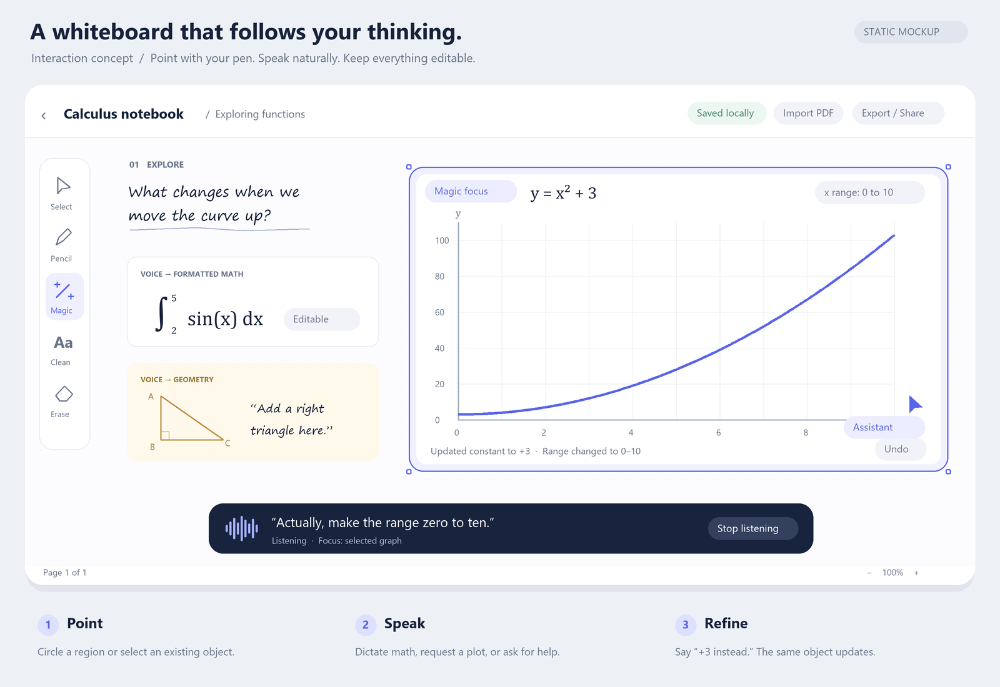
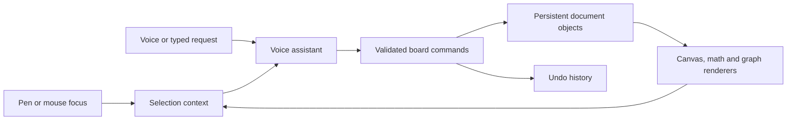

# Magic whiteboard — feasibility and prototype direction

Research checked September 26, 2026. This is an architecture proposal and static interaction mockup, not a built or device-tested application. Library capabilities below come from linked official documentation; estimates and recommendations are engineering judgments. API access, end-to-end latency, handwriting accuracy, and iPad drawing quality have not been benchmarked.

Your constraints: Windows computer and a physical iPad; roughly 24 hours; initially prototyping independently before a team of three selects one project. The priority is pointing at the board and speaking to create or change math, graphs, diagrams, and other learning material. Handwriting cleanup and homework PDFs are secondary.

**Verdict: the core experience is feasible now.** A credible first demo is feasible within the hackathon, conditional on access to a canvas license and voice API. The complete replacement for a mature notebook app is a much larger product. Breadth should come from a few reusable object types and tools, with reliable behavior, rather than a separate integration for every school subject.

**Recommended starting stack:** React + TypeScript, tldraw with custom objects, a small Node backend, OpenAI Realtime for the first voice interaction, KaTeX for equations, JSXGraph for plots and geometry, and persistent local project state. Investigate GPT-Live immediately if simultaneous conversation and background work is central. Test the same application on the physical iPad over HTTPS. Keep Capacitor as the downloadable iPad packaging path; native PencilKit/PaperKit remains an alternative if writing quality later justifies replacing the frontend.



**What the interaction means**

The pen supplies attention and the voice supplies intent. Normal Pencil creates persistent ink. Magic Pen selects a point, region, or existing object and shows a temporary highlight without leaving ink. Magic Write converts a selected stroke group into text or math, with the original ink recoverable through undo. A visible listening indicator and an explicit stop control are essential parts of the interaction.

For the first version, use tap-to-focus and a clear voice toggle. Add circle/lasso focus after the simple path works. A scribble is otherwise easy to confuse with drawing, selection, and erasure. Touch pans; the Pencil draws or selects according to the active mode. Gesture policy must be tested on the actual iPad.

Examples that share one architecture:

| Spoken request | Result |
| --- | --- |
| “Write the integral of sine x from two to five.” | Editable equation containing `\int_2^5 \sin(x)\,dx`; no automatic solving unless requested. |
| “Plot y equals x squared plus two here.” | Plot object with expression `x^2 + 2`, domain and bounds. |
| “Actually, plus three.” | Update that plot's expression while retaining its identity, position and style. |
| “Use zero to ten.” | Change the x-domain; recompute or preserve y-domain according to explicit UI policy. |
| “Draw a right triangle and label its corners.” | Vector geometry and text objects, editable independently or as a group. |
| “Explain the slope beside it.” | Text or math annotation anchored near the selected object. |

An image of a cell can be an imported or generated image object, but a triangle should be native vector geometry. Accurate diagrams and computed plots should be produced by explicit tools, rather than entrusted to an image generator.

**Reusable foundations and forks**

The [tldraw Agent Starter Kit](https://tldraw.dev/starter-kits/agent) is unusually close to the idea: it already combines selection/areas, canvas screenshots, structured shape context, and agent actions. Its [custom shape API](https://tldraw.dev/examples/custom-shape) is a strong fit for embedded equation and graph objects. Its [PDF example](https://tldraw.dev/examples/pdf-editor) demonstrates locked PDF page backgrounds and annotated export.

The licensing qualification matters: the SDK is source available, not permissively open source; deployment requires an appropriate key under the [current license](https://tldraw.dev/community/license). Starter descriptions contain inconsistent licensing language, so the SDK requirement should govern planning. This is a dependency decision, not a reason to abandon the prototype.

[Excalidraw](https://github.com/excalidraw/excalidraw) is the best MIT alternative. It supplies much of the basic whiteboard, but live mathematical objects need more integration. [BlockSuite](https://github.com/toeverything/blocksuite) is interesting for a future combined document/board editor; the standalone project is MPL-2.0. Forking all of AFFiNE or AppFlowy introduces much more application machinery than the first demo needs. Rnote and Xournal++ provide useful interaction references but their desktop toolkits are poor foundations for an iPad product. See [the canvas comparison](canvas-options.md) for source and license details.

**Architecture: one assistant with a small set of typed tools**



The application should own its document state. The LLM interprets language and proposes operations. Ordinary code checks them, changes the model, renders the result, and reports success back. Moving, resizing, rotating, plotting, saving, and undoing do not need to be performed by an LLM.

Suggested initial tools: `create_math`, `create_plot`, `update_plot`, `create_shapes`, `create_text`, `transform_objects`, and `undo`. Add `insert_image`, `recognize_ink` and `annotate_pdf` later. Java is possible for the server, but TypeScript minimizes integration work with these particular canvas and voice libraries. A small Python service becomes useful if symbolic mathematics with [SymPy](https://www.sympy.org/en/index.html) is added.

A plot might be stored as:

```json
{
  "id": "plot_17",
  "type": "plot",
  "expression": "x^2 + 3",
  "xDomain": [0, 10],
  "yDomain": [0, 110],
  "bounds": { "x": 640, "y": 260, "width": 800, "height": 460 },
  "rotation": 0,
  "revision": 4
}
```

Every voice turn captures selected IDs, region bounds, active page, last edited object and its revision. Supply nearby object data and a small screenshot crop only when needed. Explicit selection takes precedence over conversational memory. If two possible targets remain, highlight the proposed one or ask a short clarification.

Operations should be atomic and undoable. Revision checks prevent a late AI response from overwriting a more recent correction. Use an expression parser with restricted operations and computation limits; do not execute arbitrary generated JavaScript. The [math.js security documentation](https://mathjs.org/docs/expressions/security.html) discusses the relevant expression-evaluation risks. Rendering LaTeX and computing a function are separate representations: arbitrary LaTeX is not a dependable computation format.

The assistant pointer is a presentation of actual operations: animate it toward the object being edited. It need not drive the application through mouse coordinates.

**Voice choices**

| Option | Why use it here | Tradeoff |
| --- | --- | --- |
| OpenAI Realtime + Agents SDK | One session interprets speech, invokes tools and responds; custom instructions, WebRTC and interruption support. | My first choice for a compact initial implementation. |
| GPT-Live + delegated backend | Voice can listen and speak simultaneously while a separate backend reasons and uses tools. | Closest to the long-term conversational vision; separate voice/backend state and billing. Verify project access early. |
| Streaming transcription → text model → board tools | Visible, editable transcript; easy to test commands and revise math. Spoken response can be optional. | More orchestration; useful fallback and ideal for a dedicated dictation mode. |
| Gemini Live | Another supported live-audio/tool-calling provider. | Function-call concurrency differs by model; check the chosen model rather than assuming all Live variants behave alike. |

These capabilities are documented in [OpenAI's voice architecture comparison](https://developers.openai.com/api/docs/guides/voice-agents), [Realtime quickstart](https://developers.openai.com/api/docs/guides/realtime), [GPT-Live guide](https://developers.openai.com/api/docs/guides/live), [live transcription guide](https://developers.openai.com/api/docs/guides/realtime-transcription), and [Gemini Live tool documentation](https://ai.google.dev/gemini-api/docs/live-api/tools). The current OpenAI transcription guide recommends `gpt-live-transcribe`; model and session configuration should be taken from current docs when implementing.

This uses a developer API with your own prompt and functions. It is not embedding a ChatGPT app session. Use a backend for permanent credentials and issue short-lived session credentials to the client, following the [WebRTC authentication guidance](https://developers.openai.com/api/docs/guides/voice-webrtc#creating-an-ephemeral-token).

The official [Realtime Agents example](https://github.com/openai/openai-realtime-agents) provides a reusable voice/supervisor pattern, but its example model IDs should be reconciled with current API docs. [LiveKit](https://docs.livekit.io/agents/) and [Pipecat](https://docs.pipecat.ai/overview/introduction) are useful when a provider-independent audio pipeline is needed; neither is necessary just to issue whiteboard commands. [whisper.cpp](https://github.com/ggml-org/whisper.cpp) is an offline transcription option, not a complete voice assistant.

At a noisy hackathon, start with explicit voice activation. Show partial transcripts immediately, but commit board edits only when a complete validated command is available. Partial mathematical phrases often need revision. Full-duplex speech does not make ambiguous spoken formulas unambiguous.

**Math, handwriting and documents**

[KaTeX](https://katex.org/) supplies fast board equation rendering; [MathLive](https://github.com/arnog/mathlive) can provide a later correction editor. [JSXGraph](https://jsxgraph.org/home/) is a strong educational choice for interactive plots and geometry. [function-plot](https://github.com/mauriciopoppe/function-plot) is a smaller option for a first single-function plot. Rendering and numerical sampling should stay local whenever practical.

For handwriting, compare [Mathpix's raw-stroke API](https://docs.mathpix.com/reference/post-v3-strokes) and [MyScript iink](https://developer.myscript.com/docs/interactive-ink/4.2/overview/content-types/). These are commercial recognition services/engines, not generic open-source OCR libraries. A vision model can propose a transcription of a selected crop, but should not silently replace uncertain symbols. Preserve the ink and let the user edit the result. [pix2tex](https://github.com/lukas-blecher/LaTeX-OCR) is useful research material, but not a turnkey mixed-handwriting notebook solution.

Board mode and formal document mode should share semantic content while having different layout models. Board mode stores position, size and rotation. Document mode stores reading order, headings, paragraphs and equations. [MathJax](https://docs.mathjax.org/en/latest/input/tex/index.html) and KaTeX render supported TeX math; they are not full document compilers. A later export service can generate `.tex` and compile it with a full engine such as [Tectonic](https://tectonic-typesetting.github.io/en-US/).

For homework PDFs, use [PDF.js](https://github.com/mozilla/pdf.js) to render locked page backgrounds, keep editable overlays, then export an annotated copy using [pdf-lib](https://pdf-lib.js.org/). Preserve the native project separately from the flattened PDF. See [the math and handwriting comparison](math-and-handwriting.md) for alternatives and limitations.

**Testing and eventual installation on iPad**

Use a real modular application with persistence, typed commands and a backend from the start. Run it on Windows for rapid mouse testing, and serve it through an HTTPS preview URL for iPad Safari. A Home Screen installation is possible; this remains a web application at that stage. Normal browser microphone capture requires a secure context; a plain HTTP LAN address is not enough. [WebKit media capture guidance](https://webkit.org/blog/7763/a-closer-look-into-webrtc/)

[Capacitor](https://capacitorjs.com/docs/ios) can package the same web application into an iPad app and bridge native features. Its iOS build still needs Apple tooling/signing on a Mac or suitable macOS build service. A wrapper does not automatically provide native inking quality.

[React Native/Expo](https://docs.expo.dev/faq/) with [Skia](https://docs.expo.dev/versions/latest/sdk/skia/) is an alternative if an installed native app is required immediately. EAS can build iOS apps in the cloud from a Windows workflow, but development-device signing needs Apple Developer membership. Skia supplies graphics, not a ready-made notebook; the web whiteboard cannot simply be dropped into a native Skia canvas.

For a later iPad-first frontend, investigate Apple's [PencilKit](https://developer.apple.com/documentation/pencilkit), [PaperKit](https://developer.apple.com/documentation/paperkit) and PDFKit. PaperKit already adds markup objects beyond ink. Check API availability against the actual iPadOS version. Desktop device emulation tests layout, not Pencil latency, palm rejection, pressure or real Safari behavior; Apple's simulator runs in the Mac/Xcode environment. See [the iPad development notes](ipad-development.md).

**Suggested 24-hour scope** — time boxes, not delivery guarantees.

| Window | Concrete outcome |
| --- | --- |
| First 2 hours | Canvas with ink and focus; typed commands first; voice input; create a math object, a live plot and a triangle; revise a selected plot; undo; open on real iPad. If blocked, preserve typed interaction as a usable demo. |
| Hours 2–6 | If selected by the team: one person owns canvas/gesture behavior, one voice/tools/state, one math renderers and demo verification. Establish shared tool schemas before splitting work. |
| Hours 6–12 | Reliable follow-up edits, local save/reload, interruption/error states, graph ranges and object manipulation. |
| Hours 12–18 | Add the best next feature: selected handwriting conversion or homework PDF import/export. |
| Hours 18–24 | Fix iPad behavior, test noisy audio, rehearse varied requests, verify undo/save, record a backup demo. Add packaging only if build credentials/tooling are already ready. |

The first comparison demo should show: create `y=x²+2`; change it to `+3`; change x range to `0…10`; dictate an integral in another area; add a labeled triangle; move or rotate it; undo; reload. This proves creation, context, multiple representations and persistence. Continuous perfect transcription, collaborative editing, advanced chemistry structures, formal document authoring and broad graduate-level correctness belong after this core is reliable.

Success criteria: the intended object changes, nearby work remains intact, spoken confirmation matches the actual result, one undo reverses the action, and the saved document reopens correctly. Measure actual end-of-utterance-to-visible-result latency rather than promising a number before testing.
